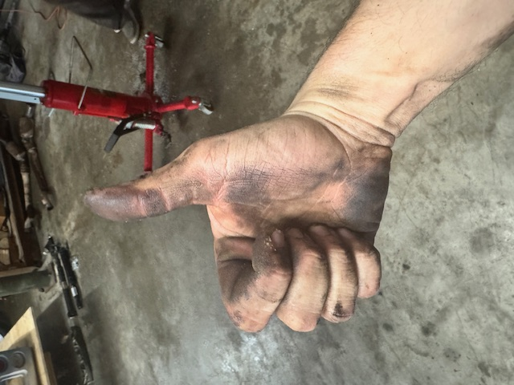

# Python Experiments
This respository contains the initial code I created to use GitHub as part of DSCI 8133, *Foundations of Data Science* at Mississippi State University.
---
## Plan
This semester, my goal is familiarize myself with data science and coding in Python using [Jypyter](https://jupyter.org/) labs.
## About Me
My name is [**Tony Garcia**](https://www.cfr.msstate.edu/people/do_people.asp?fname=Tony&lname=Garcia), and I am a **Systems Analyst** for the [**College of Forest Resources**](https://www.cfr.msstate.edu/) at [**Mississippi State University**](https://www.msstate.edu/).
My hobbies include:
- Taido karate (I earned my black belt in 2023)
- Practicing guitar
- Playing board games
- Constantly repairing my car
  
Here I am about halfway through replacing the rear main seal on my 2005 Dodge Magnum (with a great deal of help from my friends...):

